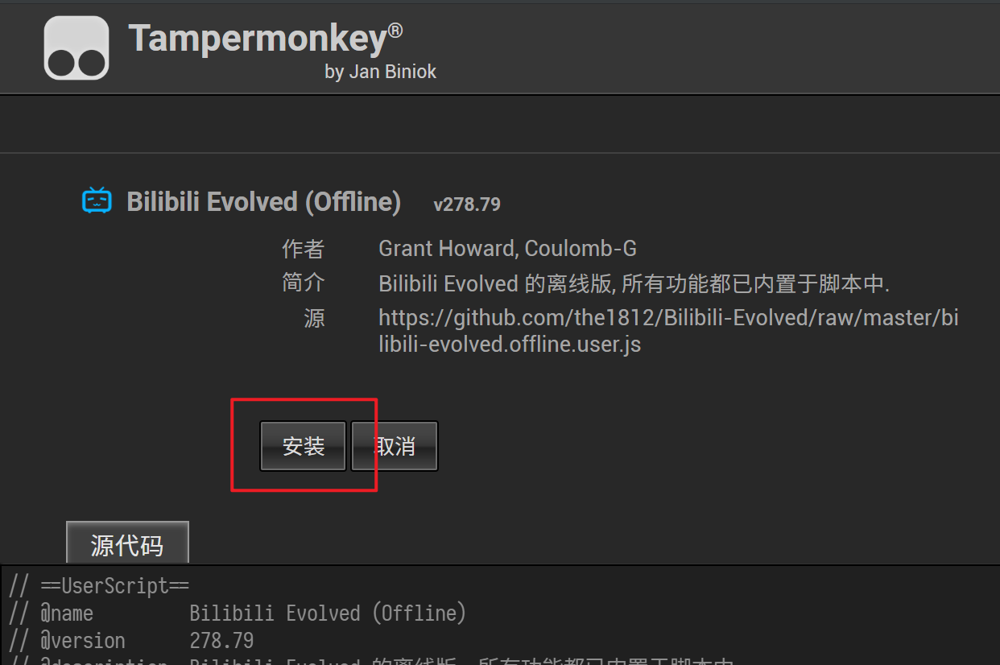
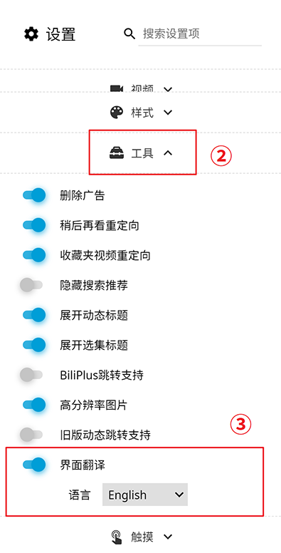

# Install tutorial
This tutorial will help you install Bilibili-Evolved in your browser.

## 1. Before install
Please check the compatibility information below to make sure your browser is compatible with Bilibili-Evolved.

> In short, Chrome, Edge (Chromium), Firefox and Safari are supported well. Most of attentions listed below won't affect functionalities. Doesn't support Edge (UWP).

### Chrome / Edge (Chromium)
- To use background blur effect ([backdrop-filter](https://developer.mozilla.org/en-US/docs/Web/CSS/backdrop-filter)), you need enable it manually in `chrome://flags/#enable-experimental-web-platform-features`. (For Edge, change `chrome` to `edge`)
- Background blur effect may cause frame drops in animation.
- If your Chrome version is ≥ 73, and screen DPI / page zoom is larger than 100%, the background blur effect will display incorrectly. See [Chromium Issue #942910](https://bugs.chromium.org/p/chromium/issues/detail?id=942910) for more information.
### Firefox
- Background blur effect is not supported, see [Bugzilla #1178765](https://bugzilla.mozilla.org/show_bug.cgi?id=1178765) for more information.
- There are some animation issues when using touch gestures. (Caused by CSS `transition`. Property value always transits from its initial value rather than current value)
### Safari
- Not tested in Safari. (I don't own a Mac)
### Edge (UWP) [**Stopped supporting**]
- Please use browsers listed above. Or you can try [Chromium-based Edge](https://microsoftedgeinsider.com/).

In this tutorial, I'll use Chrome as example:

## 2. Get a user script manager
> If you already have one, skip this step.

Bilibili-Evolved is delivered as JavaScript code snippets, a user script manager is required to help you execute the code every time you visit bilibili and keep your personal settings.

Supported managers: [Tampermonkey](https://tampermonkey.net/), [Violentmonkey](https://violentmonkey.github.io/).

Choose one you like and click the link to visit its homepage, or get it in your browser's extension store.
> You may know another manager called Greasemonkey, unfortunately it's not supported.

e.g. Install Tampermonkey from Chrome Web Store

## 3. Install
Having at least one user script manager installed, you can now select a version of Bilibili-Evolved to install. (Click the name to install)

| [Stable](https://github.com/the1812/Bilibili-Evolved/raw/master/bilibili-evolved.user.js) | [Preview](https://github.com/the1812/Bilibili-Evolved/raw/preview/bilibili-evolved.preview.user.js) | [Offline](https://github.com/the1812/Bilibili-Evolved/raw/master/bilibili-evolved.offline.user.js) | [Preview Offline](https://github.com/the1812/Bilibili-Evolved/raw/preview/bilibili-evolved.preview-offline.user.js) |
| ----------------------------------------------------------------------------------------- | --------------------------------------------------------------------------------------------------- | -------------------------------------------------------------------------------------------------- | ------------------------------------------------------------------------------------------------------------------- |
| Provides stable features, but not frequently updated.                                     | New features got tested here, updated more frequently.                                              | Inlined all dependencies to avoid GitHub server problems.                                          | As the name says, Preview + Offline.                                                                                |

> ⚠ Sometimes the breaking changes will cause old version not work at all, please update the script in time.

e.g. Install the Offline version

## 4. Change the display language (Optional)
> Language should be automatically set to your browser's default language. If not, you can follow this step to change the display language.

Visit bilibili, there should be 2 icons (Add-ons and settings) on the left side of page. Open settings by clicking the icon.

Assuming the current language is Simplified Chinese (default fallback language), unfold `工具` (tools) category and find `界面翻译` (UI translation).

Enable it and select a target language you want to see, then refresh the page.

e.g. Select English as target language

## 5. Enjoy
You are all set! Explore settings and add-ons to discover interesting features, and feel free to suggest a new feature or report a bug on my GitHub repo.